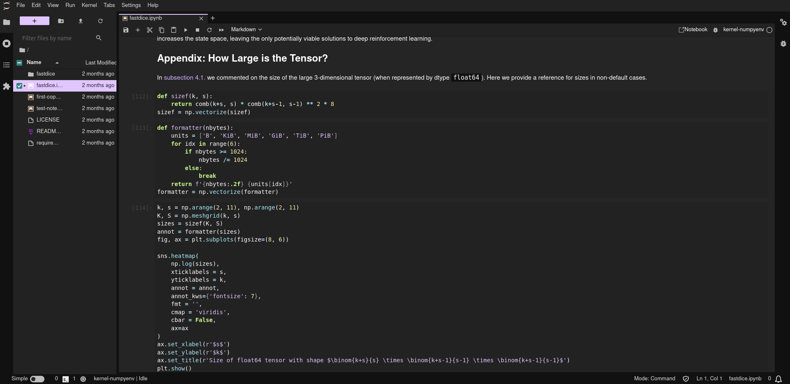

# jupyterlab_lavender

[](https://github.com/tinjano/test-jupyterextension/actions/workflows/build.yml)[](https://mybinder.org/v2/gh/tinjano/test-jupyterextension/main?urlpath=lab)

lavender, in files jupyterlab_lavender, is a JupyterLab theme extension
with a dark background, high contrast and low saturation. Example:


See also [here](https://www.github.com/tinjano/matplotlibrc)
for the simiar lavender Matplotlib styles.

## Requirements

- JupyterLab >= 4.0.0

## How to Use
Install the theme in one of the ways listed. It should be
available to use under Settings -> Theme. Check installation
with 

```bash
jupyter labextension list
```

### pip install
Coming soon

### Alternative
- Clone this repository with

```bash
git clone https://www.github.com/tinjano/jupyterlab_lavender
```

In the new folder, build (note that NodeJS is required) with

```bash
pip install -e .
jupyter labextension develop . --overwrite
jlpm run build
```

- You can also build your own extension, latest
template with guide [here](https://github.com/jupyterlab/extension-template),
then copy the file `style/variables.css`, set `isLight` to `false` in `src/index.ts`
and install as above.

### Uninstalling
Use `jupyter labextension list` to find the folder with extensions.
(it could be `$HOME/.local/share/jupyter/labextensions`) and run

```bash
rm -rf path_to_folder
```

Uninstalling with pip will not be complete.

## How to Make Your Own Extension
Since this is a niche topic, I would like to share my experience.
For the latest template with a guide see [here](https://github.com/jupyterlab/extension-template),
then see [examples](https://github.com/jupyterlab/extension-examples) with their guides.
In the case of a theme extension, the most important file is `style/variables.css`, followed
by `src/index.ts` and `style/index.css`. I have had problems with updating the extension (the
expected changes would not be visible and would indeed not be built). 
Oddly, the only solution that consistently worked was repeating this twice:
uninstall the extension and build as above.

The rest of this README is inherited from the extension template.


## Install

To install the extension, execute:

```bash
pip install lavender
```

## Uninstall

To remove the extension, execute:

```bash
pip uninstall lavender
```

## Contributing

### Development install

Note: You will need NodeJS to build the extension package.

The `jlpm` command is JupyterLab's pinned version of
[yarn](https://yarnpkg.com/) that is installed with JupyterLab. You may use
`yarn` or `npm` in lieu of `jlpm` below.

```bash
# Clone the repo to your local environment
# Change directory to the lavender directory
# Install package in development mode
pip install -e "."
# Link your development version of the extension with JupyterLab
jupyter labextension develop . --overwrite
# Rebuild extension Typescript source after making changes
jlpm build
```

You can watch the source directory and run JupyterLab at the same time in different terminals to watch for changes in the extension's source and automatically rebuild the extension.

```bash
# Watch the source directory in one terminal, automatically rebuilding when needed
jlpm watch
# Run JupyterLab in another terminal
jupyter lab
```

With the watch command running, every saved change will immediately be built locally and available in your running JupyterLab. Refresh JupyterLab to load the change in your browser (you may need to wait several seconds for the extension to be rebuilt).

By default, the `jlpm build` command generates the source maps for this extension to make it easier to debug using the browser dev tools. To also generate source maps for the JupyterLab core extensions, you can run the following command:

```bash
jupyter lab build --minimize=False
```

### Development uninstall

```bash
pip uninstall lavender
```

In development mode, you will also need to remove the symlink created by `jupyter labextension develop`
command. To find its location, you can run `jupyter labextension list` to figure out where the `labextensions`
folder is located. Then you can remove the symlink named `lavender` within that folder.

### Testing the extension

#### Frontend tests

This extension is using [Jest](https://jestjs.io/) for JavaScript code testing.

To execute them, execute:

```sh
jlpm
jlpm test
```

#### Integration tests

This extension uses [Playwright](https://playwright.dev/docs/intro) for the integration tests (aka user level tests).
More precisely, the JupyterLab helper [Galata](https://github.com/jupyterlab/jupyterlab/tree/master/galata) is used to handle testing the extension in JupyterLab.

More information are provided within the [ui-tests](./ui-tests/README.md) README.

### Packaging the extension

See [RELEASE](RELEASE.md)
